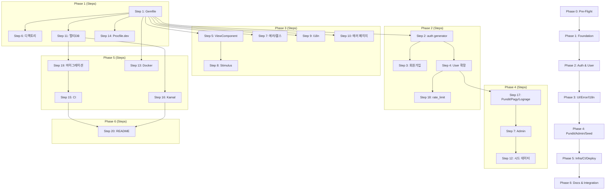

# ROADMAP: template.rb 구현 로드맵

> **버전**: 1.2
> **기준일**: 2026-02-22
> **관련 문서**: PRD v3.3, TSD v1.3
> **상태**: Phase 0~6 전체 완료

---

## 목차

1. [개요](#1-개요)
2. [기술 제약사항](#2-기술-제약사항)
3. [PRD 5.2 전체 매핑 테이블](#3-prd-52-전체-매핑-테이블)
4. [전체 의존성 그래프](#4-전체-의존성-그래프)
5. [Phase 0: Pre-Flight 검증](#5-phase-0-pre-flight-검증)
6. [Phase 1: Foundation](#6-phase-1-foundation)
7. [Phase 2: Authentication & User Model](#7-phase-2-authentication--user-model)
8. [Phase 3: UI Components, Error Handling & I18n](#8-phase-3-ui-components-error-handling--i18n)
9. [Phase 4: Authorization, Admin & Seed Data](#9-phase-4-authorization-admin--seed-data)
10. [Phase 5: Infrastructure, CI/CD & Deployment](#10-phase-5-infrastructure-cicd--deployment)
11. [Phase 6: Documentation & Integration](#11-phase-6-documentation--integration)
12. [리스크 레지스터](#12-리스크-레지스터)
13. [마일스톤 & 검증 포인트](#13-마일스톤--검증-포인트)
14. [공수 요약](#14-공수-요약)

---

## 1. 개요

이 문서는 ror-hatchling 프로젝트의 `template.rb` 구현을 위한 단계별 로드맵이다. PRD v3.3에 정의된 20개 Template Step을 7개 Phase(0-6)로 분류하고, 각 Phase의 목표, 작업 항목, 의존성, 검증 방법, 리스크를 체계적으로 정리한다.

**핵심 산출물**: `template.rb` -- Rails Application Template 파일 하나로, 아래 명령어 실행 시 프로덕션 레디 보일러플레이트를 자동 생성한다.

```bash
rails new my_app -d postgresql -c tailwind -m path/to/template.rb
```

**구현 원칙**:
- `template.rb`는 단일 파일이지만, 개발은 Phase별로 점진적으로 진행하며 각 Phase 완료 시 독립 검증이 가능해야 한다
- 각 Phase에서 생성하는 코드는 즉시 테스트 가능한 수준이어야 하며, 테스트 작성은 해당 Phase에 포함된다
- `template.rb` 내부에서 `rails new`가 이미 생성한 파일을 수정하는 경우, Rails Template API(`gsub_file`, `inject_into_file`, `create_file` 등)를 사용한다

---

## 2. 기술 제약사항

구현 전 반드시 인지해야 할 제약사항을 정리한다.

| 제약사항 | 상세 |
|---------|------|
| **외부 Gem 4개 제한** | pundit (~> 2.5), pagy (~> 43.0), lograge (~> 0.14), view_component (~> 4.4) -- 추가 불가 |
| **Zero-Build JS** | Node.js 사용 금지. Import Maps + Propshaft + standalone Tailwind CLI만 사용 |
| **Postgres-Only** | Redis 사용 금지. 모든 인프라(큐/캐시/WebSocket)는 PostgreSQL 기반 Solid Stack |
| **멀티DB** | 단일 PostgreSQL 서버에 4개 논리 DB (primary/cache/queue/cable) |
| **단일 파일 배포** | `template.rb` 한 파일로 전체 보일러플레이트 생성 (보조 파일 참조 불가) |
| **Ruby ~> 3.4** | Ruby 4.0 자동 업그레이드 방지를 위한 pessimistic version constraint |
| **Rails ~> 8.1** | Rails 8.1.x 시리즈 고정 |
| **CSS-first Tailwind** | tailwind.config.js 대신 CSS @theme 디렉티브 사용 (v4 방식) |
| **한국어 기본 로케일** | `config.i18n.default_locale = :ko` |
| **500 에러 미처리** | ApplicationController에서 500 rescue 금지 -- Rails 미들웨어에 위임 |
| **Kamal 2 + kamal-proxy** | Traefik 아닌 kamal-proxy 사용 (Rust 기반, Kamal 2 내장) |

---

## 3. PRD 5.2 전체 매핑 테이블

PRD 5.2에 정의된 20개 Template Step이 빠짐없이 Phase에 매핑되어 있음을 확인한다.

| Step | 작업 | Phase | 비고 |
|------|------|-------|------|
| 1 | Gemfile 수정 및 `bundle install` | Phase 1 | 모든 Gem 버전 핀 적용 |
| 2 | `bin/rails generate authentication` 실행 | Phase 2 | User/Session/Current 모델, 컨트롤러, 뷰, 메일러 |
| 3 | 회원가입 컨트롤러/뷰/라우트 생성 | Phase 2 | Generator 미제공 범위 |
| 4 | User 모델 확장 (role enum, 비밀번호 정책, generates_token_for) | Phase 2 | 마이그레이션 포함 |
| 5 | ViewComponent 설치 및 10종 컴포넌트 생성 | Phase 3 | ApplicationComponent 베이스 클래스 포함 |
| 6 | 디렉토리 구조 생성 (services/, policies/, components/ 등) | Phase 1 | 빈 디렉토리 + .keep 파일 |
| 7 | 공통 컨트롤러 (ApplicationController, Admin::BaseController, HealthController) | Phase 3 (에러/헬스), Phase 4 (Admin) | 분할 구현 |
| 8 | Stimulus 컨트롤러 생성 (4종) | Phase 3 | flash, modal, dropdown, navbar |
| 9 | I18n 로케일 파일 생성 | Phase 3 | ko/en, defaults/ + models/ |
| 10 | 커스텀 에러 페이지 (404, 422, 500) | Phase 3 | Tailwind 스타일링, public/ |
| 11 | database.yml 멀티DB 설정 | Phase 1 | primary/cache/queue/cable |
| 12 | 시드 데이터 구조 생성 | Phase 4 | seeds.rb + seeds/admin_user.rb + seeds/sample_data.rb |
| 13 | Docker 파일 생성 (Dockerfile + docker-compose.yml) | Phase 5 | 멀티스테이지 빌드, DB-only compose |
| 14 | Procfile.dev 생성 | Phase 1 | web + css + jobs |
| 15 | GitHub Actions CI 워크플로우 생성 | Phase 5 | 7단계 파이프라인, 캐싱 최적화 |
| 16 | Kamal 2 배포 설정 생성 | Phase 5 | deploy.yml + .kamal/secrets + hooks + SSL/error_pages 주석 |
| 17 | Pundit, Pagy, Lograge 초기 설정 | Phase 4 | 이니셜라이저 3종 |
| 18 | rate_limit 설정 | Phase 2 | SessionsController, RegistrationsController, PasswordsController |
| 19 | 초기 마이그레이션 실행 (멀티DB 포함) | Phase 5 | `rails db:prepare` + Solid Stack 마이그레이션 |
| 20 | README.md 생성 | Phase 6 | 셋업 가이드, 스케일 전환, Kamal 체크리스트 |

**검증**: 20개 Step 전체가 Phase 1-6에 매핑됨. 빠진 Step 없음.

---

## 4. 전체 의존성 그래프

### 4.1 Phase 간 의존성

```
Phase 0 (Pre-Flight 검증)
  │
  v
Phase 1 (Foundation) ─── Step 1, 6, 11, 14
  │
  v
Phase 2 (Auth & User) ── Step 2, 3, 4, 18
  │
  v
Phase 3 (UI/Error/I18n) ── Step 5, 7(에러/헬스), 8, 9, 10
  │
  v
Phase 4 (Pundit/Admin/Seed) ── Step 7(admin), 12, 17
  │                         (Pundit 설치/정책은 Phase 3과 부분 병렬 가능)
  v
Phase 5 (Infra/CI/CD/Deploy) ── Step 13, 15, 16, 19
  │
  v
Phase 6 (Docs & Integration) ── Step 20
```

**Phase 3 → Phase 4 순서**: Phase 4는 Phase 3에 의존한다.
- Phase 4의 Admin 뷰가 Phase 3의 ViewComponent(PaginationComponent 등)를 사용한다
- Phase 4의 Pundit `NotAuthorizedError` rescue가 Phase 3의 ApplicationController 에러 핸들링(Step 7)에 의존한다
- **부분 병렬 가능**: Phase 4의 Pundit 설치/정책 작성(Step 17, 4-1~4-2)은 Phase 3과 병렬 가능하나, Admin 컨트롤러/뷰(4-5~4-8)는 Phase 3 완료 후 진행해야 한다

### 4.2 Step 간 세부 의존성 (Critical Path)

```
Critical Path A (인증 → 인가 → 배포):
  Step 1 (Gemfile)
    → Step 2 (auth generator)
      → Step 4 (User 모델 확장)
        → Step 18 (rate_limit)
        → Step 17 (Pundit 초기 설정, User role 의존)
          → Step 7-admin (Admin::BaseController, Pundit 의존)
            → Step 12 (시드 데이터, admin 역할 의존)

Critical Path B (인프라 → 배포):
  Step 1 (Gemfile)
    → Step 11 (멀티DB database.yml)
      → Step 19 (마이그레이션 실행, 멀티DB 의존)
        → Step 16 (Kamal 배포, DB 구성 의존)

Critical Path C (UI → 통합):
  Step 1 (Gemfile)
    → Step 5 (ViewComponent 설치)
      → Step 8 (Stimulus, 컴포넌트와 연동)
        → Step 10 (에러 페이지, Tailwind 의존)

Convergence:
  Step 13, 15, 16, 19 (Phase 5) → Step 20 (README, 전체 기능 문서화)
```

### 4.3 Mermaid 다이어그램



---

## 5. Phase 0: Pre-Flight 검증

### 목표
template.rb 구현에 앞서 기술 조사 결과를 정리하고, 구현 전 검증이 필요한 항목을 확인한다. 코드는 작성하지 않으며, 기술적 불확실성을 사전에 해소하는 것이 목적이다.

### Template Steps 매핑
해당 없음 (구현 전 검증 단계)

### 산출물 목록
- 기술 조사 결과 검증 완료 (문서 또는 체크리스트)
- Rails Template API 프로토타입 (최소 `create_file`, `gsub_file`, `inject_into_file`, `after_bundle`, `generate`, `rails_command` 동작 확인)

### 작업 항목

- [x] **0-1. Rails Template API 동작 확인**
  - `create_file`, `gsub_file`, `inject_into_file`, `remove_file` 등 핵심 메서드 동작 확인
  - `after_bundle` 블록 내에서 generator 실행 가능 여부 확인
  - `rails_command` vs `rake` vs `generate` 차이점 확인
  - 최소 template.rb 작성 후 `rails new test_app -m template.rb` 실행하여 동작 검증

- [x] **0-2. Rails 8.1 authentication generator 출력 확인**
  - `rails generate authentication` 실행 후 생성되는 파일 목록 확인
  - User 모델, Session 모델, SessionsController, PasswordsController 코드 구조 파악
  - 생성된 마이그레이션 파일 컬럼 구조 확인
  - `inject_into_file`로 User 모델 수정 가능 여부 확인

- [x] **0-3. Solid Stack install 명령 출력 확인**
  - `solid_queue:install`, `solid_cache:install`, `solid_cable:install` 각각 실행
  - 생성되는 마이그레이션 파일, 설정 파일 목록 확인
  - 멀티DB 설정과의 충돌 여부 확인 (migrations_paths 자동 설정 여부)
  - 설치 순서 의존성 확인

- [x] **0-4. Tailwind CSS v4 + tailwindcss-rails 동작 확인**
  - `rails new` + `-c tailwind` 옵션으로 생성 시 기본 파일 구조 확인
  - `app/assets/stylesheets/application.tailwind.css` 초기 내용 확인
  - `@theme` 디렉티브, `@import "tailwindcss"` 문법 확인
  - `bin/rails tailwindcss:watch` 정상 동작 확인

- [x] **0-5. ViewComponent 4.4 설치 및 generator 확인**
  - `rails generate component` 명령 사용법 확인
  - sidecar 패턴 (같은 디렉토리에 .rb + .html.erb) 기본 설정 확인
  - `--stimulus` 플래그 존재 여부 확인
  - `ApplicationComponent` 베이스 클래스 패턴 확인

- [x] **0-6. Kamal 2 초기 설정 확인**
  - `kamal init` 실행 시 생성 파일 확인
  - `deploy.yml` 기본 구조와 PRD 요구사항 대조
  - `.kamal/secrets` 파일 형식 확인
  - hooks 디렉토리 구조 및 pre-deploy/post-deploy 훅 형식 확인

- [x] **0-7. database.yml 멀티DB 설정 검증**
  - 4개 논리 DB (primary/cache/queue/cable) 설정 문법 확인
  - `migrations_paths` 설정으로 마이그레이션 디렉토리 분리 가능 확인
  - `rails db:prepare`가 멀티DB 환경에서 정상 동작하는지 확인
  - Solid Stack의 `connects_to` 설정과의 연동 확인

- [x] **0-8. template.rb 파일 크기 및 구조 전략 수립**
  - heredoc 기반 파일 생성 시 가독성 유지 방안 결정
  - 헬퍼 메서드 정의 위치 결정 (template.rb 상단)
  - 20단계 실행 순서 최적화 (의존성 기반)
  - 에러 처리 전략 결정 (실패 시 롤백 vs 계속 진행)

### 의존성
없음 (최초 Phase)

### 검증 방법
- [x] 빈 template.rb로 `rails new test_app -d postgresql -c tailwind -m template.rb` 실행 성공 ← Task 2 완료 (9/10 테스트 통과)
- [x] authentication generator 출력 파일 목록 문서화 완료 ← Task 3 완료 (`docs/generator-outputs/authentication-output.md`)
- [x] Solid Stack install 각 명령의 출력 파일 목록 문서화 완료 ← Task 4 완료 (`docs/generator-outputs/solid-stack-output.md`)
- [x] 멀티DB database.yml 설정으로 `rails db:create` 성공 (4개 DB 생성) ← Task 4 완료 (8개 DB: dev 4 + test 4)
- [x] 8개 작업 항목 전체 체크 완료 ← 이론 조사 7개 + skeleton 1개 모두 완료

### 예상 공수
| 항목 | 순수 작업 | 버퍼(30%) | 합계 |
|------|----------|----------|------|
| Template API 검증 | 2h | 0.6h | 2.6h |
| Generator/설치 명령 확인 | 3h | 0.9h | 3.9h |
| 멀티DB/Solid Stack 검증 | 2h | 0.6h | 2.6h |
| 구조 전략 수립 | 1h | 0.3h | 1.3h |
| **소계** | **8h** | **2.4h** | **10.4h** |

### 리스크 & 완화 전략
- **Rails Template API 제약**: heredoc 내 ERB 이스케이프 문제 가능. 완화: `create_file`에서 원시 문자열 사용, 필요시 gsub로 후처리
- **Solid Stack install 순서 충돌**: 설치 명령이 database.yml을 덮어쓸 수 있음. 완화: install 전 database.yml 백업 후 병합, 또는 install 후 database.yml 재생성

---

## 6. Phase 1: Foundation

### 목표
template.rb의 기반 구조를 확립한다. Gemfile 수정, 디렉토리 생성, 멀티DB 설정, Procfile.dev 생성을 완료하여 이후 Phase에서 기능을 추가할 수 있는 토대를 마련한다.

### Template Steps 매핑
| Step | 작업 |
|------|------|
| 1 | Gemfile 수정 및 `bundle install` |
| 6 | 디렉토리 구조 생성 (services/, policies/, components/ 등) |
| 11 | database.yml 멀티DB 설정 (primary/cache/queue/cable) |
| 14 | Procfile.dev 생성 |

### 산출물 목록

**template.rb에서 생성/수정하는 파일:**

```
Gemfile                            # 수정 (Gem 추가/버전 핀)
config/database.yml                # 수정 (멀티DB 설정)
Procfile.dev                       # 수정 (jobs 프로세스 추가)
app/services/.keep                 # 생성
app/policies/.keep                 # 생성
app/components/.keep               # 생성
db/seeds/                          # 생성 (빈 디렉토리)
db/cache_migrate/.keep             # 생성
db/queue_migrate/.keep             # 생성
db/cable_migrate/.keep             # 생성
```

### 작업 항목

- [x] **1-1. Gemfile 수정 (Step 1)**
  - TSD v1.3 4.4절의 전체 Gemfile 기준으로 Gem 추가
  - `rails new -d postgresql -c tailwind`가 이미 포함하는 Gem 확인 후, 누락분만 추가
  - 추가 대상 production gems: `solid_queue`, `solid_cache`, `solid_cable`, `pundit`, `pagy`, `lograge`, `view_component`, `thruster`, `kamal`
  - 추가 대상 dev/test gems: `brakeman`, `rubocop-rails-omakase`
  - `ruby "~> 3.4"` 버전 제약 추가
  - `bundle install` 실행 (`after_bundle` 블록 활용)

- [x] **1-2. 디렉토리 구조 생성 (Step 6)**
  - `app/services/.keep` 생성
  - `app/policies/.keep` 생성
  - `app/components/.keep` 생성 (ViewComponent용)
  - `db/seeds/` 디렉토리 생성
  - `db/cache_migrate/.keep` 생성
  - `db/queue_migrate/.keep` 생성
  - `db/cable_migrate/.keep` 생성

- [x] **1-3. database.yml 멀티DB 설정 (Step 11)**
  - 기존 `config/database.yml` 교체 (전체 재작성)
  - development/test/production 각 환경에 primary/cache/queue/cable 4개 DB 정의
  - `migrations_paths` 설정: cache → `db/cache_migrate`, queue → `db/queue_migrate`, cable → `db/cable_migrate`
  - `&default` anchor에 공통 설정 (adapter, encoding, pool, timeout)
  - 환경변수 기반 접속 정보 (`DATABASE_URL` 등)

- [x] **1-4. Procfile.dev 수정 (Step 14)**
  - `rails new -c tailwind`이 이미 생성하는 Procfile.dev 확인
  - 기본: `web: bin/rails server -p 3000`, `css: bin/rails tailwindcss:watch`
  - 추가: `jobs: bin/jobs` (SolidQueue 워커)
  - `bin/jobs` 스크립트 존재 여부 확인 (SolidQueue 설치 시 자동 생성 여부)

- [x] **1-5. 환경 설정 파일**
  - `.env.example` 생성 (필요한 환경변수 문서화)
  - `.gitignore`에 `.env` 추가 확인

- [x] **1-6. Phase 1 테스트**
  - template.rb (Phase 1 범위만) 실행 후 `rails new` 성공 확인
  - `bundle install` 정상 완료 확인
  - 4개 DB 생성 확인 (`rails db:create`)
  - 디렉토리 구조 존재 확인
  - `bin/dev` 실행 시 3개 프로세스 시작 확인

### 의존성

| 선행 | 내용 |
|------|------|
| Phase 0 | Rails Template API 동작 확인, 멀티DB 설정 검증 완료 |

### 검증 방법
- [x] `rails new test_app -d postgresql -c tailwind -m template.rb` 성공
- [x] `Gemfile`에 TSD 명시 Gem 전체 포함, 버전 핀 정확
- [x] `config/database.yml`에 primary/cache/queue/cable 4개 DB 정의 확인
- [x] `rails db:create` 실행 시 4개 DB 생성 (development 환경 기준)
- [x] `app/services/`, `app/policies/`, `app/components/` 디렉토리 존재
- [x] `db/cache_migrate/`, `db/queue_migrate/`, `db/cable_migrate/` 디렉토리 존재
- [x] `Procfile.dev`에 web/css/jobs 3개 프로세스 정의

### 예상 공수
| 항목 | 순수 작업 | 버퍼(30%) | 합계 |
|------|----------|----------|------|
| Gemfile 수정 + bundle | 2h | 0.6h | 2.6h |
| 디렉토리 구조 생성 | 1h | 0.3h | 1.3h |
| database.yml 멀티DB | 3h | 0.9h | 3.9h |
| Procfile.dev + 환경 설정 | 1h | 0.3h | 1.3h |
| Phase 1 테스트 | 2h | 0.6h | 2.6h |
| **소계** | **9h** | **2.7h** | **11.7h** |

### 리스크 & 완화 전략
- **`rails new`가 이미 생성하는 Gem과의 충돌**: `rails new -d postgresql -c tailwind`이 이미 포함하는 Gem(pg, puma, turbo-rails 등)의 버전이 TSD 핀과 다를 수 있음. 완화: `gsub_file`로 버전 제약만 변경하거나, Gemfile 전체를 재생성
- **멀티DB database.yml 형식 오류**: YAML 앵커/별칭 문법 오류 가능. 완화: Phase 0에서 정확한 YAML 구조를 미리 검증하고 heredoc으로 전체 교체
- **Procfile.dev의 `bin/jobs` 부재**: SolidQueue가 아직 install 되지 않은 상태에서 bin/jobs가 없을 수 있음. 완화: bin/jobs 파일을 template에서 직접 생성하거나, SolidQueue install을 Phase 1에서 선행 실행

---

## 7. Phase 2: Authentication & User Model

### 목표
Rails 8 authentication generator를 실행하고, 회원가입 플로우를 추가하며, User 모델을 확장한다. rate_limit 설정까지 완료하여 인증/인가의 기반을 확립한다.

### Template Steps 매핑
| Step | 작업 |
|------|------|
| 2 | `bin/rails generate authentication` 실행 |
| 3 | 회원가입 컨트롤러/뷰/라우트 생성 |
| 4 | User 모델 확장 (role enum, 비밀번호 정책, generates_token_for) |
| 18 | rate_limit 설정 (SessionsController, RegistrationsController, PasswordsController) |

### 산출물 목록

**Generator가 생성하는 파일 (Step 2):**
```
app/models/user.rb                          # 수정 대상
app/models/session.rb                       # 생성
app/models/current.rb                       # 생성
app/controllers/sessions_controller.rb      # 수정 대상 (rate_limit 추가)
app/controllers/passwords_controller.rb     # 수정 대상 (rate_limit 추가)
app/controllers/concerns/authentication.rb  # 생성
app/views/sessions/                         # 생성
app/views/passwords/                        # 생성
app/mailers/passwords_mailer.rb             # 생성
db/migrate/xxx_create_users.rb              # 생성
db/migrate/xxx_create_sessions.rb           # 생성
```

**template.rb에서 추가 생성/수정하는 파일 (Step 3, 4, 18):**
```
app/controllers/registrations_controller.rb # 생성 (회원가입)
app/views/registrations/new.html.erb        # 생성 (회원가입 폼)
config/routes.rb                            # 수정 (회원가입 라우트 추가)
app/models/user.rb                          # 수정 (role enum, validation, token)
db/migrate/xxx_add_role_to_users.rb         # 생성 (role 컬럼)
app/controllers/sessions_controller.rb      # 수정 (rate_limit)
app/controllers/registrations_controller.rb # 수정 (rate_limit)
app/controllers/passwords_controller.rb     # 수정 (rate_limit)
test/models/user_test.rb                    # 생성
test/controllers/registrations_controller_test.rb # 생성
test/controllers/sessions_controller_test.rb      # 수정/생성
test/fixtures/users.yml                     # 생성/수정
```

### 작업 항목

- [x] **2-1. Authentication Generator 실행 (Step 2)**
  - `after_bundle` 블록 내에서 `rails_command "generate authentication"` 실행
  - Generator 출력 파일 확인 (Phase 0에서 파악한 목록 기준)
  - 생성된 마이그레이션에 role 컬럼이 포함되지 않음을 확인

- [x] **2-2. User 모델 확장 (Step 4)**
  - role 컬럼 추가 마이그레이션 생성: `add_column :users, :role, :integer, default: 0, null: false`
  - User 모델에 `enum :role, { user: 0, admin: 1, super_admin: 2 }` 추가
  - 비밀번호 정책 Validation 추가: `validates :password, length: { minimum: 8 }, if: -> { password.present? }`
  - `generates_token_for` 추가:
    ```ruby
    generates_token_for :email_confirmation, expires_in: 24.hours do
      email
    end
    ```
  - DB 인덱스: role 컬럼에 인덱스 추가 고려

- [x] **2-3. 회원가입 플로우 구현 (Step 3)**
  - `RegistrationsController` 생성 (`new`, `create` 액션)
  - `app/views/registrations/new.html.erb` 회원가입 폼 생성
  - 라우트 추가: `resource :registration, only: [:new, :create]`
  - 회원가입 성공 시 자동 세션 생성 및 리다이렉트
  - 실패 시 에러 메시지 표시 (I18n 키 사용)

- [x] **2-4. rate_limit 설정 (Step 18)**
  - `SessionsController`에 rate_limit 추가:
    ```ruby
    rate_limit to: 10, within: 3.minutes, only: :create,
      with: -> { redirect_to new_session_url, alert: t("rate_limit.exceeded") }
    ```
  - `RegistrationsController`에 rate_limit 추가:
    ```ruby
    rate_limit to: 5, within: 1.hour, only: :create,
      with: -> { redirect_to new_registration_url, alert: t("rate_limit.exceeded") }
    ```
  - `PasswordsController`에 rate_limit 추가:
    ```ruby
    rate_limit to: 3, within: 1.hour, only: :create,
      with: -> { redirect_to new_password_url, alert: t("rate_limit.exceeded") }
    ```

- [x] **2-5. Phase 2 테스트**
  - User 모델 단위 테스트: role enum, 비밀번호 정책, token 생성/검증
  - RegistrationsController 통합 테스트: 가입 성공/실패, 중복 이메일
  - SessionsController 통합 테스트: 로그인 성공/실패
  - rate_limit 테스트: 제한 초과 시 에러 응답 확인
  - fixtures: users.yml에 기본 사용자/관리자 데이터

### 의존성

| 선행 | 내용 |
|------|------|
| Phase 1, Step 1 | Gemfile에 bcrypt 포함되어 있어야 함 |
| Phase 1, Step 11 | database.yml 멀티DB 설정 완료 (primary DB에 users/sessions 테이블 생성) |

### 검증 방법
- [x] `rails generate authentication` 성공적으로 실행
- [x] User 모델에 role enum, 비밀번호 정책, generates_token_for 존재
- [x] 회원가입 페이지 접속 가능 (`GET /registration/new`)
- [x] 회원가입 성공 시 세션 생성 및 리다이렉트
- [x] 비밀번호 8자 미만 시 가입 실패
- [x] 로그인 시도 10회 초과 시 rate_limit 동작
- [x] `bin/rails test test/models/user_test.rb` 통과
- [x] `bin/rails test test/controllers/registrations_controller_test.rb` 통과

### 예상 공수
| 항목 | 순수 작업 | 버퍼(30%) | 합계 |
|------|----------|----------|------|
| Auth generator 실행 + 확인 | 1h | 0.3h | 1.3h |
| User 모델 확장 + 마이그레이션 | 3h | 0.9h | 3.9h |
| 회원가입 플로우 (컨트롤러/뷰/라우트) | 4h | 1.2h | 5.2h |
| rate_limit 설정 | 2h | 0.6h | 2.6h |
| 테스트 작성 | 4h | 1.2h | 5.2h |
| **소계** | **14h** | **4.2h** | **18.2h** |

### 리스크 & 완화 전략
- **Auth generator 출력 변경**: Rails 8.1.x 패치 버전에 따라 generator 출력이 미세하게 달라질 수 있음. 완화: Phase 0에서 정확한 출력 파악 후 `inject_into_file` 타겟 문자열 확정
- **rate_limit과 SolidCache 연동**: rate_limit은 `config.cache_store`를 사용. SolidCache가 Phase 5까지 install 되지 않으므로, Phase 2~4 구간에서는 Rails 기본 MemoryStore가 rate_limit 백엔드로 동작한다. 이는 개발/테스트 단계에서는 정상 동작하지만, Phase 5에서 SolidCache로 전환 후 rate_limit 정상 동작을 반드시 재검증해야 한다. 완화: Phase 5 완료 시 rate_limit 통합 테스트 재실행, README에 cache_store 의존성 명시
- **`inject_into_file` 타겟 불일치**: auth generator가 생성한 코드의 정확한 문자열을 알아야 `inject_into_file`이 동작함. 완화: 정규식 기반 매칭 또는 `gsub_file` 사용

---

## 8. Phase 3: UI Components, Error Handling & I18n

### 목표
ViewComponent 기반 10종 UI 컴포넌트와 Stimulus 컨트롤러 4종을 생성한다. 에러 핸들링(ApplicationController), 헬스체크(HealthController), I18n 로케일 파일, 커스텀 에러 페이지를 구현한다.

### Template Steps 매핑
| Step | 작업 |
|------|------|
| 5 | ViewComponent 설치 및 10종 컴포넌트 생성 |
| 7 (일부) | ApplicationController 에러 핸들링, HealthController |
| 8 | Stimulus 컨트롤러 생성 (4종) |
| 9 | I18n 로케일 파일 생성 |
| 10 | 커스텀 에러 페이지 (404, 422, 500) |

### 산출물 목록

**ViewComponent 파일 (Step 5):**
```
app/components/application_component.rb
app/components/button_component.rb
app/components/button_component.html.erb
app/components/card_component.rb
app/components/card_component.html.erb
app/components/badge_component.rb
app/components/badge_component.html.erb
app/components/flash_component.rb
app/components/flash_component.html.erb
app/components/modal_component.rb
app/components/modal_component.html.erb
app/components/dropdown_component.rb
app/components/dropdown_component.html.erb
app/components/form_field_component.rb
app/components/form_field_component.html.erb
app/components/empty_state_component.rb
app/components/empty_state_component.html.erb
app/components/pagination_component.rb
app/components/pagination_component.html.erb
app/components/navbar_component.rb
app/components/navbar_component.html.erb
```

**Stimulus 컨트롤러 (Step 8):**
```
app/javascript/controllers/flash_controller.js
app/javascript/controllers/modal_controller.js
app/javascript/controllers/dropdown_controller.js
app/javascript/controllers/navbar_controller.js
```

**공통 컨트롤러 (Step 7 일부):**
```
app/controllers/application_controller.rb    # 수정 (에러 핸들링 추가)
app/controllers/health_controller.rb         # 생성
config/routes.rb                             # 수정 (헬스체크 라우트 추가)
```

**I18n 파일 (Step 9):**
```
config/locales/ko.yml
config/locales/en.yml
config/locales/defaults/ko.yml
config/locales/defaults/en.yml
config/locales/models/ko.yml
config/locales/models/en.yml
config/initializers/locale.rb                # 생성 또는 기존 수정
```

**에러 페이지 (Step 10):**
```
public/404.html                              # 교체 (Tailwind 스타일링)
public/422.html                              # 교체 (Tailwind 스타일링)
public/500.html                              # 교체 (Tailwind 스타일링)
```

**테스트 파일:**
```
test/components/button_component_test.rb
test/components/card_component_test.rb
test/components/badge_component_test.rb
test/components/flash_component_test.rb
test/components/modal_component_test.rb
test/components/dropdown_component_test.rb
test/components/form_field_component_test.rb
test/components/empty_state_component_test.rb
test/components/pagination_component_test.rb
test/components/navbar_component_test.rb
test/controllers/health_controller_test.rb
```

### 작업 항목

- [x] **3-1. ApplicationComponent 베이스 클래스 (Step 5 일부)**
  - `app/components/application_component.rb` 생성
  - `ViewComponent::Base`를 상속하는 베이스 클래스
  - 공통 헬퍼 메서드 정의 (필요시)

- [x] **3-2. UI 컴포넌트 10종 구현 (Step 5)**
  - 각 컴포넌트별 Ruby 클래스 + ERB 템플릿 쌍으로 생성
  - **ButtonComponent**: primary/secondary/danger variant, 링크 버튼 지원
  - **CardComponent**: default/bordered variant, title/body 슬롯
  - **BadgeComponent**: success/warning/error/info variant
  - **FlashComponent**: notice/alert/error variant, Turbo 호환, Stimulus 연동 (자동 닫기)
  - **ModalComponent**: 열기/닫기/ESC, Stimulus 연동
  - **DropdownComponent**: 토글/외부클릭 닫기, Stimulus 연동
  - **FormFieldComponent**: text/email/password/select/textarea variant, 라벨+인풋+에러 묶음
  - **EmptyStateComponent**: 아이콘+메시지+액션 버튼
  - **PaginationComponent**: Pagy 연동 (pagy 객체를 받아 페이지 링크 렌더링)
  - **NavbarComponent**: 반응형, 모바일 토글, Stimulus 연동
  - 모든 컴포넌트에 Tailwind CSS 클래스 적용

- [x] **3-3. Stimulus 컨트롤러 4종 구현 (Step 8)**
  - `flash_controller.js`: 자동 닫기 타이머, 수동 닫기 버튼
  - `modal_controller.js`: 열기/닫기 토글, ESC 키 바인딩, 백드롭 클릭 닫기
  - `dropdown_controller.js`: 토글, 외부 클릭 감지 닫기
  - `navbar_controller.js`: 모바일 메뉴 토글
  - Import Maps 핀 설정 확인 (Stimulus 컨트롤러 자동 로딩)

- [x] **3-4. ApplicationController 에러 핸들링 (Step 7 일부)**
  - `rescue_from ActiveRecord::RecordNotFound` -> 404 응답
  - `rescue_from Pundit::NotAuthorizedError` -> 403 응답
  - 500 에러는 rescue하지 않음 (Rails 미들웨어 위임)
  - HTML/JSON 응답 분기 (`respond_to` 블록)

- [x] **3-5. HealthController 구현 (Step 7 일부)**
  - `GET /health` readiness 체크 엔드포인트
  - DB 연결 확인: `ActiveRecord::Base.connection.execute("SELECT 1")`
  - 성공 시 200 + JSON `{ status: "ok" }`, 실패 시 503
  - 라우트 추가: `get "/health", to: "health#show"`
  - `/up` (liveness)은 Rails 기본 제공이므로 별도 구현 불필요

- [x] **3-6. I18n 로케일 파일 생성 (Step 9)**
  - `config/initializers/locale.rb`: `config.i18n.default_locale = :ko`, load_path 설정
  - `config/locales/ko.yml`, `config/locales/en.yml`: 루트 파일
  - `config/locales/defaults/ko.yml`, `config/locales/defaults/en.yml`: 공통 UI 텍스트 (버튼, 상태, flash 메시지, rate_limit 메시지 등)
  - `config/locales/models/ko.yml`, `config/locales/models/en.yml`: 모델/속성 번역 (User 모델 등)
  - I18n load_path에 하위 디렉토리 포함 설정

- [x] **3-7. 커스텀 에러 페이지 (Step 10)**
  - `public/404.html`: Not Found 페이지 (Tailwind 인라인 스타일)
  - `public/422.html`: Unprocessable Entity 페이지 (Tailwind 인라인 스타일)
  - `public/500.html`: Internal Server Error 페이지 (Tailwind 인라인 스타일)
  - 주의: public/ 파일은 에셋 파이프라인 미사용이므로, Tailwind를 CDN 또는 인라인 스타일로 적용

- [x] **3-8. 레이아웃 업데이트**
  - `app/views/layouts/application.html.erb` 수정: FlashComponent 렌더링, NavbarComponent 렌더링
  - Stimulus 컨트롤러 연결 확인 (importmap 핀)

- [x] **3-9. Phase 3 테스트**
  - 10종 ViewComponent 단위 테스트 (render_inline + assert_selector)
  - HealthController 통합 테스트 (200/503 응답)
  - ApplicationController 에러 핸들링 통합 테스트
  - I18n 키 누락 테스트 (ko/en 동일 키 존재 확인)

### 의존성

| 선행 | 내용 |
|------|------|
| Phase 1, Step 1 | view_component, pagy Gem 설치 완료 |
| Phase 2, Step 4 | User 모델 존재 (NavbarComponent에서 로그인 상태 표시용) |
| Phase 2, Step 18 | rate_limit I18n 메시지 키 필요 (Phase 3에서 정의) |

### 검증 방법
- [x] 10종 ViewComponent 전체 render_inline 테스트 통과
- [x] FlashComponent에서 notice/alert/error 메시지 정상 표시
- [x] ModalComponent ESC 키, 백드롭 클릭으로 닫기 동작 (시스템 테스트)
- [x] DropdownComponent 외부 클릭 닫기 동작 (시스템 테스트)
- [x] `GET /health` 200 응답 (DB 연결 정상 시)
- [x] `GET /health` 503 응답 (DB 연결 실패 시)
- [x] RecordNotFound 발생 시 404 페이지 렌더링
- [x] `public/404.html`, `public/422.html`, `public/500.html` Tailwind 스타일 적용
- [x] `I18n.t("defaults.buttons.save", locale: :ko)` 정상 반환
- [x] `bin/rails test test/components/` 전체 통과

### 예상 공수
| 항목 | 순수 작업 | 버퍼(30%) | 합계 |
|------|----------|----------|------|
| ApplicationComponent + 10종 컴포넌트 | 12h | 3.6h | 15.6h |
| Stimulus 컨트롤러 4종 | 4h | 1.2h | 5.2h |
| ApplicationController 에러 핸들링 | 2h | 0.6h | 2.6h |
| HealthController | 1h | 0.3h | 1.3h |
| I18n 로케일 파일 (ko/en, defaults/models) | 4h | 1.2h | 5.2h |
| 커스텀 에러 페이지 3종 | 2h | 0.6h | 2.6h |
| 레이아웃 업데이트 | 2h | 0.6h | 2.6h |
| 테스트 작성 (컴포넌트 + 컨트롤러) | 6h | 1.8h | 7.8h |
| **소계** | **33h** | **9.9h** | **42.9h** |

### 리스크 & 완화 전략
- **ViewComponent heredoc 크기**: 10종 컴포넌트의 Ruby + ERB 코드를 모두 heredoc으로 template.rb에 포함하면 파일이 매우 커짐. 완화: 헬퍼 메서드로 반복 패턴 추출, 코드 생성 함수 정의
- **Stimulus 컨트롤러 Import Maps 연동**: Import Maps 환경에서 Stimulus 컨트롤러 자동 로딩이 제대로 동작하는지 확인 필요. 완화: `stimulus-rails`의 `stimulus:manifest:update` 명령 실행
- **에러 페이지 Tailwind 적용**: public/ 파일은 에셋 파이프라인을 통하지 않으므로 Tailwind 클래스 직접 사용 불가. 완화: Tailwind CDN 스크립트 태그 사용 또는 인라인 CSS 사용
- **PaginationComponent + Pagy 통합**: Pagy 43.x의 API 변경(DEFAULT -> options, size -> slots)에 맞춰야 함. 완화: 기술 조사 결과의 Pagy 43.x API를 정확히 반영

---

## 9. Phase 4: Authorization, Admin & Seed Data

### 목표
Pundit 인가 시스템을 설정하고, Admin 네임스페이스의 관리자 페이지를 구축하며, 시드 데이터 구조를 생성한다. Pagy, Lograge 이니셜라이저도 이 Phase에서 설정한다.

### Template Steps 매핑
| Step | 작업 |
|------|------|
| 7 (Admin 부분) | Admin::BaseController, Admin::DashboardController, Admin::UsersController |
| 12 | 시드 데이터 구조 생성 (seeds.rb, admin_user.rb, sample_data.rb) |
| 17 | Pundit, Pagy, Lograge 초기 설정 (이니셜라이저) |

### 산출물 목록

**Pundit 관련 파일 (Step 17 일부):**
```
app/policies/application_policy.rb          # 생성
app/policies/user_policy.rb                 # 생성
config/initializers/pundit.rb               # 생성 (선택적)
```

**Pagy 관련 파일 (Step 17 일부):**
```
config/initializers/pagy.rb                 # 생성
```

**Lograge 관련 파일 (Step 17 일부):**
```
config/initializers/lograge.rb              # 생성
```

**Admin 관련 파일 (Step 7 Admin 부분):**
```
app/controllers/admin/base_controller.rb    # 생성
app/controllers/admin/dashboard_controller.rb # 생성
app/controllers/admin/users_controller.rb   # 생성
app/views/layouts/admin.html.erb            # 생성
app/views/admin/dashboard/show.html.erb     # 생성
app/views/admin/users/index.html.erb        # 생성
app/views/admin/users/show.html.erb         # 생성
config/routes.rb                            # 수정 (admin 네임스페이스 추가)
```

**시드 데이터 (Step 12):**
```
db/seeds.rb                                 # 수정 (진입점, 환경별 분기)
db/seeds/admin_user.rb                      # 생성
db/seeds/sample_data.rb                     # 생성
```

**테스트 파일:**
```
test/policies/application_policy_test.rb
test/policies/user_policy_test.rb
test/controllers/admin/dashboard_controller_test.rb
test/controllers/admin/users_controller_test.rb
```

### 작업 항목

- [x] **4-1. Pundit 설치 및 ApplicationPolicy 생성 (Step 17 일부)**
  - `generate "pundit:install"` 실행 -> ApplicationPolicy 생성
  - ApplicationController에 `include Pundit::Authorization` 추가
  - ApplicationPolicy 기본 정책 검토 (모든 액션 기본 거부)

- [x] **4-2. UserPolicy 생성**
  - 일반 사용자: 자기 자신만 show/update 허용
  - admin/super_admin: 모든 사용자 show, index 허용
  - super_admin: 사용자 역할 변경 허용

- [x] **4-3. Pagy 이니셜라이저 (Step 17 일부)**
  - `config/initializers/pagy.rb` 생성
  - `Pagy::DEFAULT[:limit] = 25` (페이지당 항목 수)
  - `Pagy::DEFAULT[:size] = [1, 4, 4, 1]` -> 주의: v43에서는 `Pagy::DEFAULT[:slots]` 사용 여부 확인
  - ApplicationController에 `include Pagy::Backend` 추가
  - ApplicationHelper에 `include Pagy::Frontend` 추가 (또는 PaginationComponent에서 처리)

- [x] **4-4. Lograge 이니셜라이저 (Step 17 일부)**
  - `config/initializers/lograge.rb` 생성
  - JSON 포매터: `config.lograge.formatter = Lograge::Formatters::Json.new`
  - custom_payload: `user_id`, `request_id`, `remote_ip`
  - custom_options: params 필터링 (password 등)
  - ignore_actions: `["HealthController#show"]`
  - production 환경에서만 활성화 또는 전 환경 활성화 여부 결정

- [x] **4-5. Admin::BaseController 구현 (Step 7 Admin 부분)**
  - `Admin::BaseController < ApplicationController`
  - `before_action :require_admin` (Pundit 기반 역할 확인)
  - 관리자 레이아웃 사용: `layout "admin"`
  - admin 전용 인증 체크 (admin? 또는 super_admin?)

- [x] **4-6. Admin 레이아웃 생성**
  - `app/views/layouts/admin.html.erb` 생성
  - 관리자 전용 사이드바/네비게이션
  - Tailwind 스타일링, 별도 디자인
  - FlashComponent 렌더링 포함

- [x] **4-7. Admin::DashboardController 구현**
  - `show` 액션: 관리자 대시보드 메인 페이지
  - 기본 통계 표시 (사용자 수, 최근 가입 등)
  - 라우트: `namespace :admin do root "dashboard#show" end`

- [x] **4-8. Admin::UsersController 구현**
  - `index` 액션: 사용자 목록 (Pagy 페이지네이션)
  - `show` 액션: 사용자 상세 정보
  - Pundit policy_scope 활용
  - PaginationComponent 연동

- [x] **4-9. 시드 데이터 구조 생성 (Step 12)**
  - `db/seeds.rb` 수정: 진입점 역할, `db/seeds/` 하위 파일 로드
  - `db/seeds/admin_user.rb`: 기본 관리자 계정 생성 (환경변수 또는 기본값)
  - `db/seeds/sample_data.rb`: 개발용 샘플 데이터 (development 환경만)
  - `find_or_create_by` 사용하여 중복 생성 방지

- [x] **4-10. Admin 라우트 설정**
  - `config/routes.rb`에 admin 네임스페이스 추가:
    ```ruby
    namespace :admin do
      root "dashboard#show"
      resources :users, only: [:index, :show]
    end
    ```

- [x] **4-11. Phase 4 테스트**
  - Pundit 정책 단위 테스트 (ApplicationPolicy, UserPolicy)
  - Admin::DashboardController 통합 테스트 (관리자만 접근 허용)
  - Admin::UsersController 통합 테스트 (목록/상세, 페이지네이션)
  - 일반 사용자 admin 접근 시 403 확인
  - 비로그인 시 admin 접근 시 리다이렉트 확인
  - 시드 데이터 실행 후 관리자 계정 존재 확인

### 의존성

| 선행 | 내용 |
|------|------|
| Phase 2, Step 4 | User 모델에 role enum 존재 (admin 역할 체크) |
| Phase 2, Step 2 | Authentication concern (로그인 체크) |
| Phase 3, Step 5 | ViewComponent (Admin 뷰에서 사용, PaginationComponent 등) |
| Phase 3, Step 7 | ApplicationController에 에러 핸들링 설정 (Pundit::NotAuthorizedError rescue) |

### 검증 방법
- [x] `generate "pundit:install"` 성공, ApplicationPolicy 존재
- [x] admin 역할 사용자로 `/admin` 접근 시 대시보드 표시
- [x] 일반 사용자로 `/admin` 접근 시 403 에러
- [x] `/admin/users` 페이지네이션 정상 동작 (Pagy + PaginationComponent)
- [x] Lograge 설정 후 요청 로그가 JSON 한 줄 형식으로 출력
- [x] `rails db:seed` 실행 후 관리자 계정 생성 확인
- [x] `bin/rails test test/policies/` 전체 통과
- [x] `bin/rails test test/controllers/admin/` 전체 통과

### 예상 공수
| 항목 | 순수 작업 | 버퍼(30%) | 합계 |
|------|----------|----------|------|
| Pundit 설치 + ApplicationPolicy + UserPolicy | 3h | 0.9h | 3.9h |
| Pagy + Lograge 이니셜라이저 | 2h | 0.6h | 2.6h |
| Admin::BaseController + 레이아웃 | 3h | 0.9h | 3.9h |
| Admin::Dashboard + Users 컨트롤러/뷰 | 5h | 1.5h | 6.5h |
| 시드 데이터 (seeds.rb + 하위 파일) | 2h | 0.6h | 2.6h |
| 라우트 설정 | 1h | 0.3h | 1.3h |
| 테스트 작성 | 5h | 1.5h | 6.5h |
| **소계** | **21h** | **6.3h** | **27.3h** |

### 리스크 & 완화 전략
- **Pundit + Authentication concern 통합**: `current_user`가 nil일 때 Pundit이 에러를 발생시킬 수 있음. 완화: `Admin::BaseController`에서 `before_action :authenticate`를 Pundit 체크 전에 실행
- **Pagy v43 API 변경**: `DEFAULT` -> `options`, `size` -> `slots` 변경이 문서마다 다르게 기재됨. 완화: 기술 조사 결과 확인 후 정확한 API 사용 (실제로는 `Pagy::DEFAULT`가 여전히 사용됨)
- **Admin 레이아웃 Tailwind 스타일링**: 별도 레이아웃에서 application과 다른 스타일 적용 필요. 완화: 동일 Tailwind 빌드를 공유하되 레이아웃 구조만 분리
- **시드 데이터 비밀번호 하드코딩**: 관리자 기본 비밀번호가 코드에 노출됨. 완화: 환경변수(`ADMIN_PASSWORD`)로 주입, 기본값은 development 전용

---

## 10. Phase 5: Infrastructure, CI/CD & Deployment

### 목표
Docker 설정, GitHub Actions CI 파이프라인, Kamal 2 배포 설정을 생성하고, 초기 마이그레이션을 실행한다. 프로덕션 배포 준비를 완료한다.

### Template Steps 매핑
| Step | 작업 |
|------|------|
| 13 | Docker 파일 생성 (Dockerfile + docker-compose.yml) |
| 15 | GitHub Actions CI 워크플로우 생성 (7단계 파이프라인) |
| 16 | Kamal 2 배포 설정 생성 (deploy.yml + .kamal/secrets + hooks) |
| 19 | 초기 마이그레이션 실행 (멀티DB 포함) |

### 산출물 목록

**Docker 파일 (Step 13):**
```
Dockerfile                                  # 수정 (멀티스테이지, Thruster 포함)
docker-compose.yml                          # 수정 (PostgreSQL 17 DB-only)
.dockerignore                               # 수정 (필요시)
```

**GitHub Actions (Step 15):**
```
.github/workflows/ci.yml                    # 생성
```

**Kamal 배포 (Step 16):**
```
config/deploy.yml                           # 수정 (Kamal 2 설정)
.kamal/secrets                              # 생성
.kamal/hooks/pre-deploy                     # 생성
.kamal/hooks/post-deploy                    # 생성 (선택적)
```

**마이그레이션 (Step 19):**
```
# 실행만, 파일 생성은 이전 Phase에서 완료
# rails db:prepare (primary + cache + queue + cable)
```

**Solid Stack 설정 파일:**
```
config/solid_queue.yml                      # 생성 (또는 install 시 자동)
config/solid_cache.yml                      # 생성 (또는 install 시 자동)
config/cable.yml                            # 수정 (SolidCable 설정)
config/environments/production.rb           # 수정 (cache_store, queue_adapter 등)
config/environments/development.rb          # 수정 (cache_store, queue_adapter 등)
```

### 작업 항목

- [x] **5-1. Solid Stack 설치 및 설정 (Step 19 준비)**
  - `solid_queue:install` 실행 -> 마이그레이션, 설정 파일 생성
  - `solid_cache:install` 실행 -> 마이그레이션, 설정 파일 생성
  - `solid_cable:install` 실행 -> 마이그레이션, 설정 파일 생성
  - 각 install 명령이 database.yml을 수정할 경우 병합 처리
  - `config/environments/production.rb` 수정:
    - `config.active_job.queue_adapter = :solid_queue`
    - `config.cache_store = :solid_cache_store`
    - `config.action_cable.adapter = "solid_cable"` (cable.yml에서 설정)
  - `config/environments/development.rb` 수정:
    - `config.active_job.queue_adapter = :solid_queue`
    - `config.cache_store = :solid_cache_store`

- [x] **5-2. Docker 파일 수정 (Step 13)**
  - `Dockerfile` 확인 및 수정 (Rails 8 기본 멀티스테이지 빌드 활용):
    - 빌드 스테이지: `ruby:3.4.8-slim`, build-essential, libpq-dev
    - 런타임 스테이지: `ruby:3.4.8-slim`, libpq5 최소 의존성
    - Thruster 포함 확인
  - `docker-compose.yml` 수정:
    - PostgreSQL 17 서비스 (DB-only)
    - 4개 논리 DB에 해당하는 초기화 스크립트 (또는 rails db:create에 위임)
    - 볼륨 마운트 (데이터 영속성)
    - 포트 매핑 (5432)
  - `.dockerignore` 확인 및 수정

- [x] **5-3. GitHub Actions CI 워크플로우 (Step 15)**
  - `.github/workflows/ci.yml` 생성
  - 트리거: `push` (main), `pull_request`
  - 7단계 파이프라인:
    1. Ruby 설정 (`ruby/setup-ruby`, bundler-cache: true)
    2. 에셋 캐싱 (Tailwind CLI 빌드 결과, Propshaft 에셋 캐시)
    3. DB 생성 + 마이그레이션 (서비스 컨테이너: postgres, 멀티DB)
    4. RuboCop 린트 (`bundle exec rubocop`)
    5. Brakeman 보안 스캔 (`bundle exec brakeman`)
    6. Minitest 실행 (`bin/rails test`)
    7. 시스템 테스트 (`bin/rails test:system`, headless Chrome)
  - 캐싱 전략:
    - Bundler gems: `Gemfile.lock` 해시
    - Tailwind 빌드: `app/assets/tailwind/**` 해시
    - Propshaft 에셋: `app/assets/**` 해시
  - 서비스 컨테이너: `postgres:17` (환경변수로 4개 DB 생성)

- [x] **5-4. Kamal 2 배포 설정 (Step 16)**
  - `config/deploy.yml` 수정:
    - service, image, registry (배포 대상 레지스트리)
    - servers: web 서버 IP (플레이스홀더)
    - proxy: kamal-proxy 설정 (healthcheck, ssl 주석)
    - env: 환경변수 (DATABASE_URL, RAILS_MASTER_KEY 등)
    - accessories: PostgreSQL (선택적, 외부 DB 사용 시 불필요)
  - `.kamal/secrets` 생성:
    - `KAMAL_REGISTRY_PASSWORD`, `RAILS_MASTER_KEY`, `DATABASE_URL` 등
    - `.gitignore`에 `.kamal/secrets` 추가
  - `.kamal/hooks/pre-deploy` 생성:
    - 마이그레이션 실행: `docker exec ... rails db:prepare`
  - SSL 설정 주석:
    ```yaml
    # proxy:
    #   ssl: true
    #   host: your-domain.com
    ```
  - error_pages_path 설정 주석:
    ```yaml
    # proxy:
    #   error_pages_path: /rails/public
    ```

- [x] **5-5. 초기 마이그레이션 실행 (Step 19)**
  - `rails_command "db:prepare"` -- primary DB 마이그레이션
  - Solid Stack 마이그레이션:
    - `rails_command "db:prepare:cache"` (또는 해당 명령)
    - `rails_command "db:prepare:queue"`
    - `rails_command "db:prepare:cable"`
  - 멀티DB 마이그레이션 실행 순서 확인
  - 마이그레이션 실패 시 에러 핸들링

- [x] **5-6. 환경별 설정 정리**
  - `config/environments/production.rb`: force_ssl, cache_store, queue_adapter, log_level
  - `config/environments/development.rb`: cache_store, queue_adapter
  - `config/environments/test.rb`: 테스트 환경 설정
  - CSP(Content Security Policy) 설정: `config/initializers/content_security_policy.rb`

- [x] **5-7. Phase 5 테스트**
  - Docker: `docker-compose up db` 정상 기동, PostgreSQL 17 접속 확인
  - CI: ci.yml 문법 검증 (`actionlint` 또는 수동 확인)
  - Kamal: `deploy.yml` 문법 검증
  - 마이그레이션: 4개 DB 전체 마이그레이션 성공 확인
  - Solid Stack: SolidQueue 잡 실행, SolidCache 캐시 저장/조회, SolidCable 동작 확인

### 의존성

| 선행 | 내용 |
|------|------|
| Phase 1, Step 11 | database.yml 멀티DB 설정 |
| Phase 2 전체 | User/Session 마이그레이션 (Step 19에서 실행) |
| Phase 3, Step 7 | HealthController (Kamal healthcheck 대상) |
| Phase 4, Step 17 | Lograge 설정 (production 환경 로깅) |

### 검증 방법
- [x] `docker-compose up db` 실행 시 PostgreSQL 17 컨테이너 기동
- [x] `rails db:prepare` 실행 시 4개 DB 전체 마이그레이션 성공
- [x] `.github/workflows/ci.yml` 문법 유효 (YAML lint 통과)
- [x] `config/deploy.yml` 문법 유효 (YAML lint 통과)
- [x] `SolidQueue::Job` 테이블 존재 확인 (queue DB)
- [x] `SolidCache::Entry` 테이블 존재 확인 (cache DB)
- [x] `SolidCable::Message` 테이블 존재 확인 (cable DB)
- [x] production 환경에서 `config.cache_store`가 `:solid_cache_store`
- [x] production 환경에서 `config.active_job.queue_adapter`가 `:solid_queue`

### 예상 공수
| 항목 | 순수 작업 | 버퍼(30%) | 합계 |
|------|----------|----------|------|
| Solid Stack 설치 + 설정 | 4h | 1.2h | 5.2h |
| Docker 파일 수정 | 3h | 0.9h | 3.9h |
| GitHub Actions CI | 4h | 1.2h | 5.2h |
| Kamal 2 배포 설정 | 4h | 1.2h | 5.2h |
| 초기 마이그레이션 + 멀티DB | 3h | 0.9h | 3.9h |
| 환경별 설정 정리 | 2h | 0.6h | 2.6h |
| 테스트 + 검증 | 3h | 0.9h | 3.9h |
| **소계** | **23h** | **6.9h** | **29.9h** |

### 리스크 & 완화 전략
- **Solid Stack install과 database.yml 충돌**: 각 install 명령이 database.yml에 항목을 추가하면서 Phase 1에서 설정한 구조를 깨뜨릴 수 있음. 완화: install 명령 실행 후 database.yml을 다시 덮어쓰기(Phase 1의 멀티DB 설정으로), 또는 install을 Phase 1 이전에 실행하고 database.yml을 최종 형태로 재생성
- **멀티DB 마이그레이션 순서**: Solid Stack 마이그레이션이 특정 DB에 대해서만 실행되어야 하는데, 기본 `db:prepare`가 전체 DB를 처리하는지 확인 필요. 완화: `db:prepare:primary`, `db:prepare:cache` 등 개별 실행
- **CI 서비스 컨테이너 멀티DB**: GitHub Actions의 postgres 서비스 컨테이너에서 4개 논리 DB를 생성해야 함. 완화: CI 워크플로우에서 `rails db:create` 명시적 실행
- **Kamal deploy.yml 플레이스홀더**: 실제 서버 IP, 레지스트리 정보가 없는 상태에서 유효한 설정 작성. 완화: 주석과 플레이스홀더로 명확히 표시, README에 설정 방법 안내

---

## 11. Phase 6: Documentation & Integration

### 목표
README.md를 생성하고, 전체 template.rb의 통합 테스트를 수행한다. template.rb를 처음부터 끝까지 실행하여 생성된 앱이 정상 동작하는지 최종 검증한다.

### Template Steps 매핑
| Step | 작업 |
|------|------|
| 20 | README.md 생성 |

### 산출물 목록

**README.md (Step 20):**
```
README.md                                   # 생성 (전체 프로젝트 문서)
```

### 작업 항목

- [x] **6-1. README.md 생성 (Step 20)**
  PRD 5.3에 정의된 포함 내용:
  - 프로젝트 소개 및 기술 스택
  - 로컬 개발 환경 셋업 가이드:
    - `docker-compose up db` -> `bin/setup` -> `bin/dev`
    - PostgreSQL 17 + 4개 논리 DB 구조 설명
  - ViewComponent 기반 UI 컴포넌트 사용법 및 예시:
    - 10종 컴포넌트 목록, variant, 사용 예시 코드
  - 테스트 실행 방법:
    - `bin/rails test`, `bin/rails test:system`, `bundle exec rubocop`, `bundle exec brakeman`
  - Kamal 2 배포 가이드:
    - `deploy.yml` 설정 방법
    - `.kamal/secrets` 설정
    - `kamal setup` / `kamal deploy` 실행
  - 디렉토리 구조 설명
  - 선택적 기능 활성화 가이드:
    - Active Record Encryption 활성화 (`bin/rails db:encryption:init`)
    - rate_limit store 커스터마이징
    - 비밀번호 정책 강화
  - 스케일 전환 가이드:
    - Postgres-only -> Redis 분리 시점 판단 기준
    - Solid Cable -> Redis adapter 전환 절차
    - Solid Queue -> Sidekiq/GoodJob 전환 절차
    - Solid Cache -> Redis cache store 전환 절차
  - 프론트엔드 확장 가이드:
    - Import Maps -> jsbundling-rails(esbuild) 전환 체크리스트
    - 전환 시 Procfile.dev / CI 워크플로우 변경 사항
  - Kamal 배포 체크리스트:
    - kamal-proxy SSL 구성 시 확인 사항
    - `proxy.ssl` 활성화 시 `forward_headers` 설정
    - healthcheck URL/포트 검증

- [x] **6-2. 통합 테스트 (End-to-End)**
  - 클린 환경에서 `rails new test_app -d postgresql -c tailwind -m template.rb` 실행
  - 전체 20단계 정상 완료 확인
  - `bin/setup` 실행 성공 (DB 생성, 마이그레이션, 시드)
  - `bin/dev` 실행 후 3개 프로세스 기동 확인
  - `bin/rails test` 전체 테스트 통과
  - `bin/rails test:system` 시스템 테스트 통과
  - `bundle exec rubocop` 위반 0건
  - `bundle exec brakeman` 보안 이슈 0건 (또는 허용 범위)

- [x] **6-3. 최종 점검 체크리스트**
  - [x] 외부 Gem 4개 제한 준수 확인
  - [x] PRD 5.2 20단계 전체 실행 확인
  - [x] 한국어 기본 로케일 동작 확인
  - [x] ViewComponent 10종 렌더링 확인
  - [x] Admin 페이지 접근 제어 확인
  - [x] rate_limit 동작 확인
  - [x] 멀티DB 4개 DB 정상 동작 확인
  - [x] Docker + docker-compose 정상 기동
  - [x] CI yml 유효성 확인
  - [x] deploy.yml 유효성 확인
  - [x] README 내용 완전성 확인

### 의존성

| 선행 | 내용 |
|------|------|
| Phase 1-5 전체 | 모든 기능 구현 완료 |

### 검증 방법
- [x] 클린 환경에서 `rails new` + template.rb 실행 성공 (에러 0건)
- [x] 생성된 앱에서 `bin/rails test` 전체 통과
- [x] 생성된 앱에서 `bin/rails test:system` 전체 통과
- [x] 생성된 앱에서 `bundle exec rubocop` 통과
- [x] 생성된 앱에서 `bundle exec brakeman` 통과 (또는 허용 수준)
- [x] README.md에 PRD 5.3 정의 항목 전체 포함
- [x] 두 번 연속 `rails new` 실행 시 동일 결과 (멱등성 확인)

### 예상 공수
| 항목 | 순수 작업 | 버퍼(30%) | 합계 |
|------|----------|----------|------|
| README.md 작성 | 6h | 1.8h | 7.8h |
| 통합 테스트 (E2E 실행 + 디버깅) | 6h | 1.8h | 7.8h |
| 최종 점검 + 수정 | 4h | 1.2h | 5.2h |
| **소계** | **16h** | **4.8h** | **20.8h** |

### 리스크 & 완화 전략
- **template.rb 통합 실행 시 누적 에러**: 개별 Phase에서 동작하던 코드가 전체 순차 실행 시 충돌할 수 있음. 완화: 각 Phase 완료 시 누적 template.rb로 통합 테스트 실행
- **README 내용 과다**: PRD 5.3 요구 항목이 많아 README가 지나치게 길어질 수 있음. 완화: 목차(TOC) 제공, 핵심 내용은 README에, 상세 가이드는 별도 docs/ 파일 참조 가능성 열어둠
- **멱등성 실패**: template.rb를 두 번 실행하면 파일 중복 생성이나 설정 충돌 가능. 완화: `create_file`에 force 옵션 사용, `gsub_file`은 이미 변경된 경우 무시

---

## 12. 리스크 레지스터

프로젝트 전체에서 식별된 주요 리스크를 정리한다.

### 주요 리스크

| # | 리스크 | 영향 | 확률 | Phase | 완화 전략 | 대응 계획 |
|---|--------|------|------|-------|----------|----------|
| R1 | ~~Solid Stack install이 database.yml을 덮어쓰기~~ | ~~높음~~ | ~~높음~~ | ~~1, 5~~ | **해소** (Phase 0 검증 완료) | Solid Stack install은 database.yml 미수정 확인. production 멀티DB는 `rails new`가 자동 생성 |
| R2 | ~~Auth generator 출력 변경~~ | ~~높음~~ | ~~중간~~ | ~~2~~ | **해소** (Phase 0 검증 완료) | 실제 출력 캡처 완료. inject_into_file 타겟 4개 확정 (`docs/generator-outputs/authentication-output.md`) |
| R3 | **template.rb 파일 크기 비대화** | 중간 | 높음 | 3, 4 | 헬퍼 메서드 5개 정의 (say_phase, say_step, create_component, create_locale, create_test) | skeleton 812줄. 실제 구현 시 ~2500줄 예상. 구조 재설계 기준: 3000줄 |
| R4 | **에러 페이지 Tailwind CDN 의존** | 중간 | 중간 | 3 | 인라인 CSS 사용 또는 빌드된 CSS 인라인 삽입 | CDN 없이 순수 CSS로 작성 |
| R5 | **CI 멀티DB 설정 복잡도** | 중간 | 중간 | 5 | Phase 0에서 GitHub Actions postgres 서비스 + 멀티DB 설정 사전 검증 | CI에서 `rails db:create` 명시적 실행, 초기화 스크립트 제공 |
| R6 | **rate_limit과 cache_store 타이밍 불일치** | 낮음 | 높음 | 2, 5 | Phase 2에서 rate_limit 설정 시 MemoryStore 기반으로 동작함을 인지, Phase 5에서 SolidCache 전환 후 재검증 | Phase 5 검증 시 rate_limit 통합 테스트 필수 포함 |
| R7 | **cable.yml force:true 덮어쓰기** (신규) | 중간 | 높음 | 1, 5 | `solid_cable:install`이 `config/cable.yml`을 `force:true`로 덮어씀 | 커스텀 cable.yml 설정은 install 이후에 적용. Rails 8.1 `rails new`가 자동 설치하므로 template.rb에서 별도 install 불필요 |
| R8 | **Schema 파일 vs Migration 혼동** (신규) | 낮음 | 확정 | 5 | Solid Stack은 `db/*_schema.rb` 파일 사용 (timestamped migration 아님) | `db:prepare`가 자동 처리. 인지 사항으로 문서화 |

### 리스크 모니터링 기준

- **높음 (High)**: 발생 시 해당 Phase 일정 1일 이상 지연
- **중간 (Medium)**: 발생 시 해당 작업 항목 2시간 이상 추가 소요
- **낮음 (Low)**: 발생 시 1시간 이내 해결 가능

---

## 13. 마일스톤 & 검증 포인트

각 Phase 완료 시 독립적으로 검증 가능한 산출물과 검증 방법을 정리한다.

| Phase | 마일스톤 | 핵심 산출물 | 독립 검증 가능 여부 | 검증 명령어 |
|-------|---------|-----------|-------------------|-----------|
| 0 | **기술 검증 완료** | 검증 체크리스트 | O | 수동 확인 |
| 1 | **기반 구조 확립** | template.rb (Phase 1), 4개 DB 생성 | O | `rails new test -m template.rb && cd test && rails db:create` |
| 2 | **인증 시스템 완성** | template.rb (Phase 1+2), 회원가입/로그인 동작 | O | `rails test test/models/user_test.rb test/controllers/` |
| 3 | **UI 시스템 완성** | template.rb (Phase 1-3), 10종 컴포넌트 렌더링 | O | `rails test test/components/` |
| 4 | **인가/관리자 완성** | template.rb (Phase 1-4), Admin 접근 제어 | O | `rails test test/policies/ test/controllers/admin/` |
| 5 | **배포 준비 완료** | template.rb (Phase 1-5), CI/Kamal 설정 | O | `rails db:prepare && rails test` |
| 6 | **최종 릴리즈** | template.rb (전체), README.md | O | 클린 환경 E2E + 전체 테스트 스위트 |

**누적 검증 원칙**: 각 Phase 완료 시, 이전 Phase까지 누적된 template.rb를 클린 환경에서 실행하여 회귀 테스트를 수행한다.

---

## 14. 공수 요약

| Phase | 이름 | 순수 작업 | 버퍼(30%) | 합계 |
|-------|------|----------|----------|------|
| 0 | Pre-Flight 검증 | 8h | 2.4h | 10.4h |
| 1 | Foundation | 9h | 2.7h | 11.7h |
| 2 | Authentication & User Model | 14h | 4.2h | 18.2h |
| 3 | UI Components, Error Handling & I18n | 33h | 9.9h | 42.9h |
| 4 | Authorization, Admin & Seed Data | 21h | 6.3h | 27.3h |
| 5 | Infrastructure, CI/CD & Deployment | 23h | 6.9h | 29.9h |
| 6 | Documentation & Integration | 16h | 4.8h | 20.8h |
| **총계** | | **124h** | **37.2h** | **161.2h** |

**일정 환산** (1일 = 6시간 실작업 기준):

| Phase | 예상 일수 |
|-------|----------|
| Phase 0 | 약 2일 |
| Phase 1 | 약 2일 |
| Phase 2 | 약 3일 |
| Phase 3 | 약 7일 |
| Phase 4 | 약 5일 |
| Phase 5 | 약 5일 |
| Phase 6 | 약 4일 |
| **총계** | **약 28일 (약 5.5주)** |

**참고**: Phase 4의 Pundit 설치/정책 작성(4-1~4-3)을 Phase 3과 부분 병렬 진행 시 약 1-2일 단축 가능 (약 26-27일, 약 5주). 단, Admin 컨트롤러/뷰 작업은 Phase 3 완료 후 진행해야 한다.

---

## 변경 이력

| 버전 | 날짜 | 변경 내용 |
|------|------|----------|
| v1.0 | 2026-02-21 | 초안 작성. PRD v3.3, TSD v1.3 기반 6개 Phase + Pre-Flight 로드맵 |
| v1.1 | 2026-02-21 | 검증 피드백 반영: Phase 3→4 의존성 명확화(병렬→순차), Mermaid 다이어그램 S7e 의존성 수정, rate_limit/cache_store 타이밍 리스크(R6) 추가, 공수 병렬 단축 추정치 조정 |
| v1.2 | 2026-02-22 | **Phase 0 완료 반영**: R1/R2 해소 (실행 검증 완료), R7(cable.yml force:true)/R8(schema 파일) 신규 추가, R3 현황 업데이트 (skeleton 812줄). Rails 8.1 발견사항: `pool:`→`max_connections:`, Solid Stack 자동 설치, production-only 멀티DB. 산출물: `docs/phase0-verification.md`, `docs/generator-outputs/`, `template.rb` (skeleton) |
